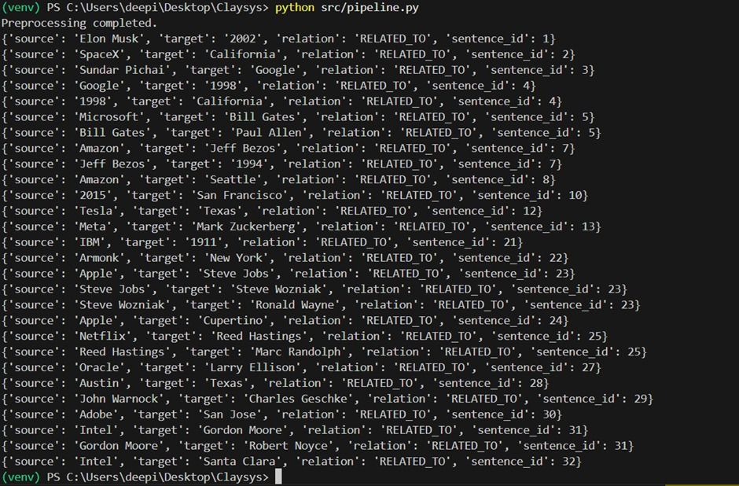
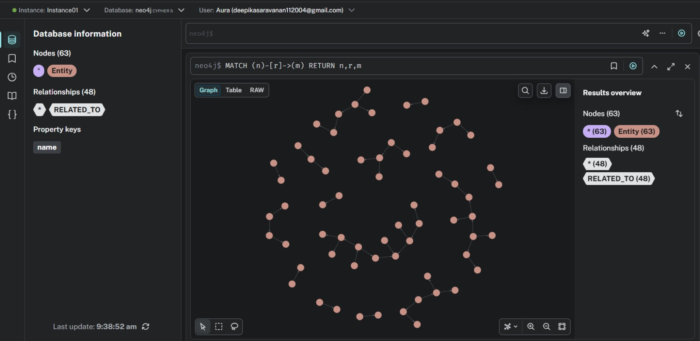

# 🧠 Knowledge Graph Builder from Text using NLP & Neo4j

This project builds a **Knowledge Graph from unstructured text** by extracting entities and relationships using NLP and storing them in **Neo4j Aura** for interactive visualization and querying.  
It demonstrates an end-to-end AI pipeline from raw text to graph-based knowledge representation, with a simple **Flask UI** for user interaction.

---

## ✨Features

- Text-based knowledge extraction from unstructured documents
- Named Entity Recognition (NER) using SpaCy
- Rule-based relation extraction
- Graph storage in Neo4j Aura (cloud-based)
- Interactive graph visualization
- Single-page Flask UI for user input
- End-to-end pipeline execution with one click

---

## 🚀 Installation & Setup

### 1. Clone the repository
```bash
git clone https://github.com/Deepika-saravanan/Knowledge_Graph_Builder_from_Text.git
cd Knowledge_Graph_Builder_from_Text
```

### 2. Create virtual environment
```bash
python -m venv venv
venv\Scripts\activate
```

### 3. Install dependencies
```bash
pip install -r requirements.txt
```

### 4. Configure Neo4j Aura
Update `config.py`:
```python
NEO4J_URI = "neo4j+s://<instance>.databases.neo4j.io"
NEO4J_USER = "neo4j"
NEO4J_PASSWORD = "<password>"
```

### 5. Run the application
```bash
python app.py
```

Open in browser:
```text
http://127.0.0.1:5000
```

---

## ⚙️ How It Works

1. User provides text via UI or dataset file  
2. Text is cleaned and split into sentences  
3. Entities are extracted using SpaCy  
4. Relations are generated using rule-based logic  
5. Graph nodes and edges are created in Neo4j Aura  
6. Graph is visualized in Neo4j Browser  

---

## 📝 Example Input

```text
Elon Musk founded SpaceX in 2002. SpaceX is headquartered in California.
Sundar Pichai is the CEO of Google. Google was founded in 1998.
Microsoft was founded by Bill Gates and Paul Allen.
```

---

## 📸 Output Screenshots

### 🧹Preprocessing & Entity Extraction


### 🔗 Relation Extraction


### 🌐 Knowledge Graph in Neo4j Aura


---

## 🏗️ Architecture

```text
User Input (UI)
      |
      v
Text Preprocessing
      |
      v
Entity Extraction (SpaCy)
      |
      v
Relation Extraction
      |
      v
Neo4j Aura (Graph DB)
      |
      v
Graph Visualization
```

---

## 📁 Project Structure

```text
Knowledge_graph_builder/
│
├── app.py                 # Flask UI entry point
├── config.py              # Neo4j Aura credentials
├── requirements.txt       # Dependencies
├── README.md              # Project documentation
│
├── data/
│   ├── raw_text/           # Input datasets
│   └── processed/          # Cleaned & sentence-split text
│
├── src/
│   ├── ingestion/          # Text loading
│   ├── preprocessing/      # Cleaning & sentence splitting
│   ├── nlp/                # SpaCy entity + relation extraction
│   ├── graph/              # Neo4j insertion logic
│   └── pipeline.py         # End-to-end pipeline
│
├── templates/              # Flask HTML templates
├── static/                 # CSS / assets
│
├── screenshots/            # Output evidence
│   ├── preprocessing_output.png
│   ├── relation_output.png
│   └── neo4j_graph.png
│
└── venv/                   # Virtual environment (ignored in git)
```

---

## 🔎 Trade-offs Considered

- Used rule-based relation extraction instead of LLMs to keep the system explainable and deterministic.
- Used Neo4j Aura instead of local Neo4j to simplify setup and enable cloud deployment.
- Chose a simple Flask UI instead of a complex frontend to focus on core pipeline reliability.
- Focused on end-to-end system design rather than model accuracy alone.

---

## 📘 Colab Notebook

Colab demo (pipeline explanation & outputs):  
https://colab.research.google.com/drive/13LOWVPdd-Mh20I6DjNRRfA-8E_-J8C2V

---

## 🧩 Design Decisions

- Neo4j chosen for natural relationship representation
- Neo4j Aura used to avoid local DB installation
- Rule-based extraction keeps system explainable
- Flask UI improves usability for non-technical users

---

## ⚠️ Limitations

- Relations are rule-based, not learned
- No coreference resolution
- Generic schema (Entity, RELATED_TO)
- UI triggers pipeline but does not render graph

---

## 🔮 Future Work

- Transformer-based relation extraction
- Entity type labeling
- Graph search from UI
- Multi-document ingestion
- Graph analytics (centrality, communities)

---

## 📌 Disclaimer

This project is for educational and evaluation purposes only and demonstrates applied NLP, knowledge representation, and system design concepts.

---
## 👩‍💻 Author
Built by Deepika
